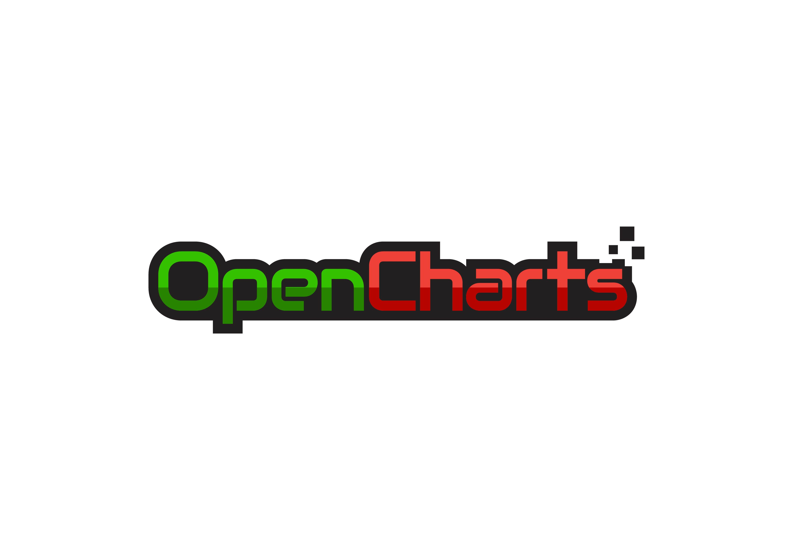

# Opencharts


OpenCharts is a community-driven, open source and FREE data visualization 
web app created using Streamlit, 
Pandas and Plotly Express.<br>
https://www.openchart.org/
<hr>

It allows anyone create beautiful charts from their data with only a few clicks, and is similar in
 function to other proprietary software such as PowerBI etc.
 <br>
 
 In its current state, OpenCharts can be used to create: <br>
 1) Density contour
 2) Histogram
 3) Box plots
 4) Violin plots
 5) Scatter plots. <br>
 6) Pie
 7) Sunburst
 8) Treemap
 9) Density heatmap
 
 Much more charts would be added in time. These charts can be exported in 
 different formats such as:<br>
 
 1) PNG.
 2) JPEG.
 3) SVG.
 4) PDF.
 5) HTML.
 6) JSON.
 
 ## Future roadmap
I believe that people should be able to create beautiful charts without 
burning a hole in their pocket. The future versions of this app would 
incorporate the following features:<br>
1) Support for the following chart types - lineplots, areaplots, barplots,
  scatter matrix and chloropleth.
2) Some basic dataframe capabilities such as - data type setup for each column, 
dropping of columns, etc. 
3) (Stretch goal) Support for data import from other locations (for e.g. database,  url links).
4) (Stretch goal) Spreadsheet editing functionality.

## How to run the app
1) Clone this repo.
2) Install all requirements using: <br> ```pip install -r requirements.txt``` <br>
3) From the terminal within the directory <br> ```streamlit run datavisualapp.py```

